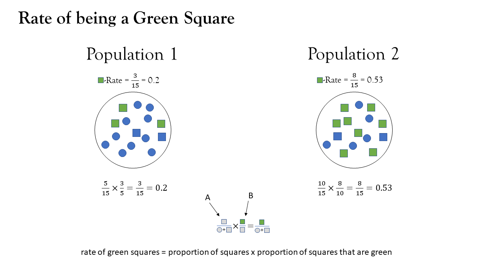
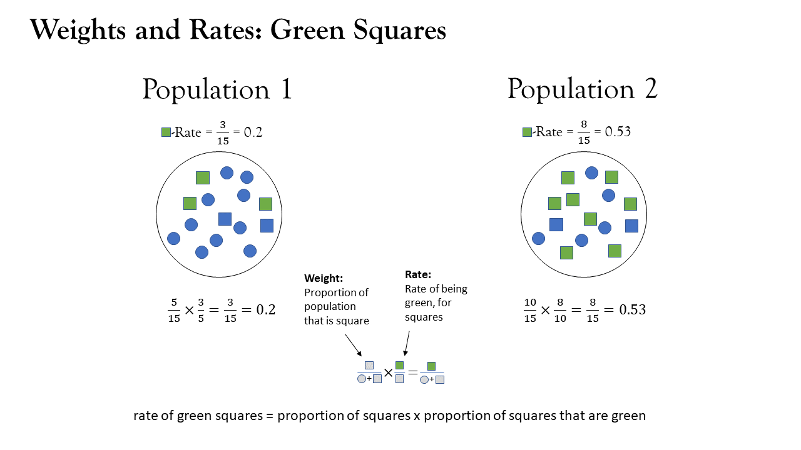
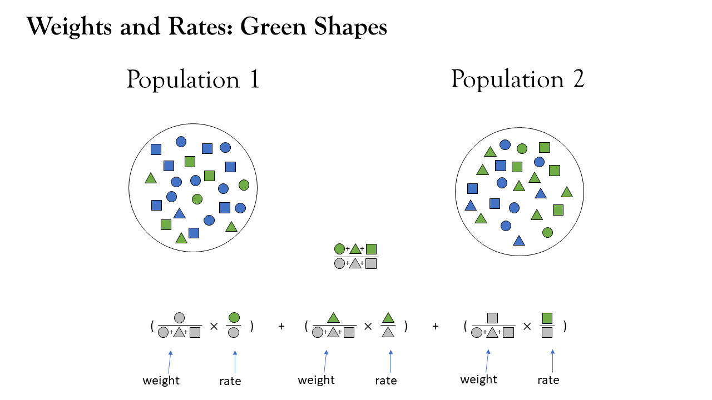
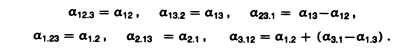

```{r}
#| include: false
options(digits=4)
library(tidyverse)
library(DasGuptR)
```

# Population sub-groups  

---

{fig-align="center" width="100%"}
---

{fig-align="center" width="100%"}


## population structure

::::{.columns}
:::{.column width="50%"}
```{r}
#| echo: true
mydat <- tribble(
  ~pop, ~shape,   ~nshp, ~ngrn, ~weight, ~rate,
  1,    "circle",    10,     2, 10/24,  2/10,
  1,    "square",    10,     3, 10/24,  3/10,
  1,    "triangle",   4,     3,  4/24,  3/4,
  2,    "circle",     7,     2,  7/24,  2/7,
  2,    "square",     7,     4,  7/24,  4/7,
  2,    "triangle",  10,     7, 10/24,  7/10,
)
```
:::
:::{.column width="50%"}
```{r}
#| echo: true
mydat
```
:::
::::

---

{fig-align="center" width="100%"}

---


{fig-align="center" width="100%"}


## population share

::::{.columns}
:::{.column width="50%"}

relative size of sub group is another factor

$$
\text{Green Rate} = \sum\limits_{\text{shape }i}  \frac{n_{i}}{n} \cdot \frac{green_{i}}{n_{i}}
$$
:::
:::{.column width="50%"}
```{r}
#| echo: true
mydat |>
  group_by(pop) |>
  summarise(
    crude_rate_v1 = sum(ngrn) / sum(nshp),
    crude_rat_v2 = sum(weight * rate)
  )
```
:::
::::


## decomposition within each sub-group?

::::{.columns}
:::{.column width="40%"}

1. separate out data into each subgroup

2. do decomposition of weight * rate on each subgroup

3. sum it all up

:::
:::{.column width="60%"}

$$ \small
\begin{align}
W\text{-effect} = \,\,&(W_{2\,\bigcirc} - W_{1\,\bigcirc})\left( \frac{R_{1\,\bigcirc}+R_{2\,\bigcirc}}{2} \right) \\
&+ \\
&(W_{2\,\triangle} - W_{1\,\triangle})\left( \frac{R_{1\,\triangle}+R_{2\,\triangle}}{2} \right) \\
&+ \\
&(W_{2\,\square} - W_{1\,\square})\left( \frac{R_{1\,\square}+R_{2\,\square}}{2} \right) \\
\end{align}
$$


:::
::::

What a lot of effort! 


```{r}
#| include: false
bind_rows(
  dgnpop(
  mydat[mydat$shape=="square", ],
  pop="pop",
  factors=c("weight","rate")
  ) ,
  dgnpop(
  mydat[mydat$shape=="circle", ],
  pop="pop",
  factors=c("weight","rate")
  ) ,
  dgnpop(
  mydat[mydat$shape=="triangle", ],
  pop="pop",
  factors=c("weight","rate")
  ) 
) |> group_by(factor,pop) |> 
  summarise(rate= sum(rate)) |> dg_table()
```

## decomposition on vectors

do the decomposition of weight * rate, but instead of a single number, these are vectors.  

$$
W\text{-effect} = \,\, (\vec{W}_{2} - \vec{W}_{1})\left( \frac{\vec{R}_{1}+\vec{R}_{2}}{2} \right)
$$
$$
\vec{W} = \begin{bmatrix} W_{\bigcirc} \\ W_{\triangle} \\ W_{\square} \end{bmatrix}, \vec{R} = \begin{bmatrix} R_{\bigcirc} \\ R_{\triangle} \\ R_{\square} \end{bmatrix}, 
$$

## decomposition on vectors

::::{.columns}
:::{.column width="50%"}
```{r}
#| echo: true
dgnpop(x = mydat,
       pop = "pop",
       factors=c("weight","rate"),
       ratefunction = "sum(weight * rate)") |>
  dg_table()
```

:::
:::{.column width="50%"}

Note we need to specify the `ratefunction`.  
  
When weights and rates are vectors, then `weight * rate` will return a vector, but we need it to return a summary value, e.g., `sum(weight * rate)`  


:::
::::


## alternatively (or equivalently):  

::::{.columns}
:::{.column width="50%"}
```{r}
#| echo: true
dgnpop(x = mydat,
       pop = "pop",
       factors = c("rate"),
       id_vars = "shape",
       crossclassified = "nshp") |>
  dg_table()
```
:::
:::{.column width="50%"}

if we're thinking about things in terms of population *composition*, then we can make use of:  

- `id_vars` : specify the variable(s) that define sub-groups
- `crossclassified` : specify the variable that gives the sub-group size

With just one variable defining the sub-groups, this is (usually$^*$) just the same as the method on the slide previous  

:::
::::


<!-- :::aside -->
<!-- $*$ where sub-group rates are defined by multiple factors, e.g., $rate_i = a_i * b_i$, then it decomposes rates $r_i$ prior to decomposing $rate = \sum weight_i * rate_i$. This means it misses the three-way interaction $a*b*weight$ instead capturing only $r*weight$ -->
<!-- ::: -->

## $^*$aside

::::{.columns}
:::{.column width="50%"}
population subgroup composition is a driver of the rate construction 

```{r}
#| echo: true
#| eval: false
dgnpop(x = data,
       pop = "pop",
       factors=c("weight","a","b","c"),
       ratefunction = "sum(weight * a * b * c)") |>
  dg_table()
```
decomposition of population rate with weights as a composite factor
<br><br>
$$
\sum\limits_i w_i \,\,\cdot a_i \,\cdot\, b_i \,\cdot\, c_i
$$

:::
:::{.column width="50%"}
population subgroups are 'containers' for the rate
```{r}
#| echo: true
#| eval: false
dgnpop(x = data,
       pop = "pop",
       factors = c("a","b","c"),
       id_vars = "subgroup",
       crossclassified = "subgroup_size")
```
within-subgroup decomposition of rates, *and* decomposition of population rate as sum of weights*rates.
$$
\sum\limits_i w_i \,\,\cdot \underset{\uparrow \atop a_i \cdot b_i \cdot c_i}{r_i}
$$
:::
::::


# "cross-classified"  

## sub-groups defined by multiple variables

combinations of age, sex, race, area, etc.  

::::{.columns}
:::{.column width="50%"}
```{r}
expand_grid(pop=1:2,i = 1:2,j = 1:3) |>
  mutate(
    size = paste0("n_",i,j),
    rate = paste0("r_",i,j)
  ) 
```
:::
:::{.column width="50%"}
```{r}
expand_grid(pop=1:2,i = 1:2,j = 1:3,k=1:2) |>
  mutate(
    size = paste0("n_",i,j,k),
    rate = paste0("r_",i,j,k)
  )
```
:::
::::

## example: 

::::{.columns}
:::{.column width="50%"}
```{r}
#| code-fold: true
#| echo: true
eg5.3 <- tibble(
  pop = rep(c(1985, 1970), e = 22),
  age = rep(rep(1:11, 2), 2),
  race = rep(rep(1:2, e = 11), 2),
  # number of people in age-race-group
  size = c(
    3041, 11577, 27450, 32711, 35480, 27411, 19555, 19795, 15254, 8022, 
    2472, 707, 2692, 6473, 6841, 6547, 4352, 3034, 2540, 1749, 804, 236,
    2968, 11484, 34614, 30992, 21983, 20314, 20928, 16897, 11339, 5720, 
    1315, 535, 2162, 6120, 4781, 3096, 2718, 2363, 1767, 1149, 448, 117
  ),
  # death rate in age-race-group
  rate = c(
    9.163, 0.462, 0.248, 0.929, 1.084, 1.810, 4.715, 12.187, 27.728, 64.068, 157.570, 
    17.208, 0.738, 0.328, 1.103, 2.045, 3.724, 8.052, 17.812, 34.128, 68.276, 125.161, 
    18.469, 0.751, 0.391, 1.146, 1.287, 2.672, 6.636, 15.691, 34.723, 79.763, 176.837, 
    36.993, 1.352,0.541, 2.040, 3.523, 6.746, 12.967, 24.471, 45.091, 74.902, 123.205
  )
)

eg5.3
```

```{r}
#| echo: false
#| eval: false
set.seed(4356)
df = eg5.3
df$size = round(rnorm(nrow(df), df$age*30+df$race*20+df$age*df$race*50,20))
df$rate = rnorm(nrow(df),df$size*.03,5)
df <- df |> group_by(pop) |>
  mutate(
    agerace = interaction(age,race),
    agerace_w = size/sum(size),
    .after = race
  ) |> ungroup()
eg5.3<-df
```


:::
:::{.column width="50%"}


:::
::::


## combined ij-mix contribution

::::{.columns}
:::{.column width="50%"}
```{r}
#| code-fold: true
#| echo: true
eg5.3a <- eg5.3 |>
  group_by(pop) |>
  mutate(
    agerace = interaction(age,race),
    agerace_w = size/sum(size),
  ) |> ungroup()

eg5.3a
```

```{r}
#| echo: false
#| eval: false
set.seed(4356)
df = eg5.3
df$size = round(rnorm(nrow(df), df$age*30+df$race*20+df$age*df$race*50,20))
df$rate = rnorm(nrow(df),df$size*.03,5)
df <- df |> group_by(pop) |>
  mutate(
    agerace = interaction(age,race),
    agerace_w = size/sum(size),
  ) |> ungroup()
eg5.3<-df
```


:::
:::{.column width="50%"}
```{r}
#| echo: true
dgnpop(x = eg5.3a,
       pop = "pop",
       factors = c("agerace_w","rate"),
       ratefunction = "sum(agerace_w * rate)") |>
  dg_table()
```
:::
::::

## separate i and j contributions?  

ignoring the ij interaction..  (Don't do this!!)

::::{.columns}
:::{.column width="50%"}
```{r}
#| code-fold: true
#| echo: true
eg5.3b <- 
  eg5.3 |> 
    group_by(pop) |>
    mutate(
      popsize = sum(size)
    ) |>
    group_by(pop, age) |>
    mutate(
      age_w = sum(size)/popsize
    ) |> 
    group_by(pop,race) |>
    mutate(
      race_w = sum(size)/popsize
    ) |>
    ungroup() |> select(-popsize)

eg5.3b
```
:::
:::{.column width="50%"}
```{r}
#| echo: true
dgnpop(x = eg5.3b,
       pop = "pop",
       factors = c("age_w","race_w","rate"),
       ratefunction = "sum(age_w * race_w * rate)") |>
  dg_table()
```
:::
::::

## separate i and j contributions

symetrically separating out ij interaction  

::::{.columns}
:::{.column width="50%"}
```{r}
eg5.3
```

:::
:::{.column width="50%"}
```{r}
#| echo: true
dgnpop(x = eg5.3,
       pop = "pop",
       factors = c("rate"),
       id_vars = c("age","race"),
       crossclassified = "size") |>
  dg_table()
```
:::
::::


## requirements

- exhaustive stratification - sub-groups should cover 100% of the population of interest.  

- both populations must have same subgroups  

- no subgroups of size zero


# More than two populations? 

## example

```{r}
#| code-fold: true
#| echo: true
scbrth <- 
  tribble(
    ~year, ~n_people, ~n_women, ~n_women1544, ~n_births,
    1991,   5083330,  2638815,      1121555,     67024,
    2000,   5062940,  2631014,      1079356,     53076,
    2010,   5262200,  2713982,      1058324,     58791,
  ) |>
  mutate(
    crude = n_births/n_people*1e3,
    propw = n_women/n_people,
    propw1544 = n_women1544/n_women,
    bpw = n_births/n_women1544*1e3
  )
scbrth
```

## a problem..  

if we just look at pairwise decompositions..  

::::{.columns}
:::{.column width="50%"}
```{r}
#| code-fold: true
#| echo: true
dgnpop(scbrth[1:2,], pop="year",
       factors=c("propw","propw1544","bpw")) |>
  dg_table()
```

```{r}
#| code-fold: true
#| echo: true
dgnpop(scbrth[2:3,], pop="year",
       factors=c("propw","propw1544","bpw")) |>
  dg_table()
```

```{r}
#| code-fold: true
#| echo: true
dgnpop(scbrth[c(1,3),], pop="year",
       factors=c("propw","propw1544","bpw")) |>
  dg_table()
```
:::
:::{.column width="50%" .fragment}

We have multiple sets of standardised rates.    

And internally inconsistent decomposition effects.  

What we want:   
$$\small
\begin{align}
\text{BPW-effect}_{\text{1991v2010}} &= \text{BPW-effect}_{\text{1991v2000}} + \\ & \quad \,\,\,\,\text{BPW-effect}_{\text{2000v2010}}
\end{align}
$$

What we have:  
$$\small
\begin{align}
-0.88746 &\neq -2.29626 + 1.32099 \\
-0.88746 &\neq -0.9753 \,\,!?!?\\
\end{align}
$$


:::
::::

## a solution

Averaging over different possible ways to achieve consistency through substituting in standardised rates for one another. 

e.g.,:  
{width="750px"}

## In DasGuptR

It does it all for us:  

```{r}
#| echo: true
dgnpop(scbrth, pop="year",
       factors=c("propw","propw1544","bpw")) |>
  dg_table()
```

Note we don't get the decomposition effects unless we specify which pair of populations.  
These are now based on standardisation across the full set.  

```{r}
#| echo: true
dgnpop(scbrth, pop="year",
       factors=c("propw","propw1544","bpw")) |>
  dg_table(1991, 2010)
```

## plots

::::{.columns}
:::{.column width="50%"}
```{r}
#| echo: true
dgnpop(scbrth, pop="year",
       factors=c("propw","propw1544","bpw")) |>
  dg_plot()
```

:::
:::{.column width="50%"}
```{r}
#| echo: true
dgnpop(scbrth, pop="year",
       factors=c("propw","propw1544","bpw")) |>
  ggplot(aes(x = pop, y = rate, 
             col = factor, group = factor))+
  geom_line() +
  theme_minimal()
```
:::
::::


# End