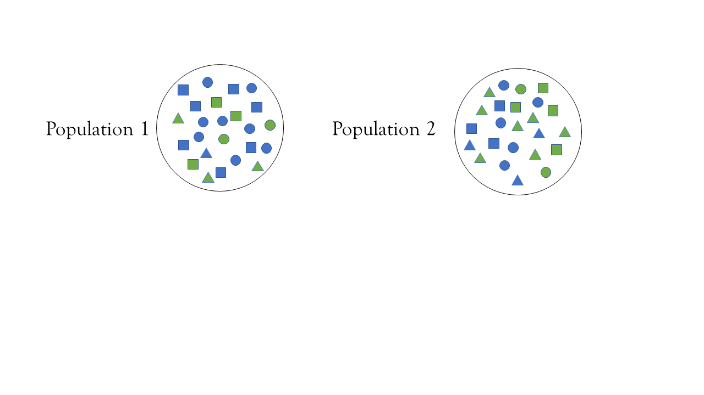
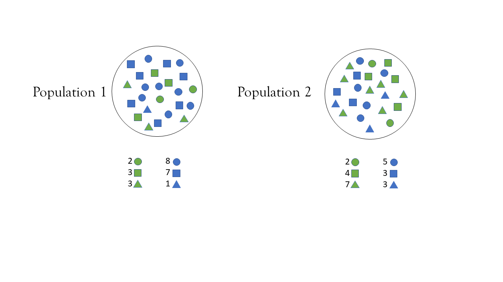

```{r}
#| include: false
options(digits=2)
```

## Picking up at 3-factors

### 3 factor  

::::{.columns}
:::{.column width="50%"}
```{r}
#| echo: true
library(tibble)

mydat <- tribble(
  ~pop,~pcol,~psq,~pgr,
  "P1", 11/15, 4/11, 3/4,
  "P2", 13/15, 10/13, 8/10,
) 
mydat
```

:::
:::{.column width="50%"}

```{r}
#| echo: true
library(DasGuptR)

dgres <- dgnpop(x = mydat,
       pop = "pop",
       factors = c("pcol","psq","pgr"))

dg_table(dgres)
```

:::
::::


# Sub-populations


## sub-populations

{fig-align="center" width="100%"}

## sub-populations

{fig-align="center" width="100%"}

## sub-populations

::::{.columns}
:::{.column width="50%"}
```{r}
#| echo: true
mydat <- tribble(
  ~pop, ~shape,    ~pshp, ~pgreen,
  1,    "circle",  10/24,  2/10,
  1,    "square",  10/24,  3/10,
  1,    "triangle", 4/24,  3/4,
  2,    "circle",   7/24,  2/7,
  2,    "square",   7/24,  4/7,
  2,    "triangle",10/24,  8/10,
)
mydat
```
:::
:::{.column width="50%"}

$$Rate_{green} = \sum\limits_i ( \frac{n_{i-}}{n_{--}}) *\cdot \frac{n_{i\text{ green}}}{n_{i-}} )$$


:::
::::

## population share

- relative size of sub group is another factor

sum ( w_i * r_i )

## rate = sum(group size * group rate)


## sub-populations

```{r}
#| echo: true
dgnpop(x = mydat,
       pop = "pop",
       factors = c("pshp","pgreen"),
       id_vars = c("shape"),
       ratefunction = "sum(pshp*pgreen)") |>
  dg_table()
```


```{r}
#| include: false

eg5.1 <- data.frame(
  age_group = rep(c("15-19", "20-24", "25-29", "30-34", 
                    "35-39", "40-44", "45-49", "50-54", 
                    "55-59", "60-64", "65-69", "70-74", 
                    "75+"), 2),
  pop = rep(c(1970, 1985), e = 13),
  # number in age-group / total population * 100
  size = c(
    12.9, 10.9, 9.5, 8.0, 7.8, 8.4, 8.6, 7.8, 7.0, 5.9, 4.7, 3.6, 4.9, 
    10.1, 11.2, 11.6, 10.9, 9.4, 7.7, 6.3, 6.0, 6.3, 5.9, 5.1, 4.0, 5.5
  ),
  # age-group specific rate
  rate = c(
    1.9, 25.8, 45.7, 49.6, 51.2, 51.6, 51.8, 54.9, 58.7, 60.4, 62.8, 66.6, 66.8, 
    2.2, 24.3, 45.8, 52.5, 56.1, 55.6, 56.0, 57.4, 57.2, 61.2, 63.9, 68.6, 72.2
  )
)
eg5.1$age_prop = eg5.1$size/100
eg5.3 <- data.frame(
  race = rep(rep(1:2, e = 11), 2),
  age = rep(rep(1:11, 2), 2),
  pop = rep(c(1985, 1970), e = 22),
  # number of people in age-race-group
  size = c(
    3041, 11577, 27450, 32711, 35480, 27411, 19555, 19795, 15254, 8022, 
    2472, 707, 2692, 6473, 6841, 6547, 4352, 3034, 2540, 1749, 804, 236,
    2968, 11484, 34614, 30992, 21983, 20314, 20928, 16897, 11339, 5720, 
    1315, 535, 2162, 6120, 4781, 3096, 2718, 2363, 1767, 1149, 448, 117
  ),
  # death rate in age-race-group
  rate = c(
    9.163, 0.462, 0.248, 0.929, 1.084, 1.810, 4.715, 12.187, 27.728, 64.068, 157.570, 
    17.208, 0.738, 0.328, 1.103, 2.045, 3.724, 8.052, 17.812, 34.128, 68.276, 125.161, 
    18.469, 0.751, 0.391, 1.146, 1.287, 2.672, 6.636, 15.691, 34.723, 79.763, 176.837, 
    36.993, 1.352,0.541, 2.040, 3.523, 6.746, 12.967, 24.471, 45.091, 74.902, 123.205
  )
)
```

dasguptr
needs appropriate ratefunction that aggregates up


```{r}
#| eval: false
head(eg5.1)

library(DasGuptR)
# uh-oh!
dgnpop(eg5.1,
  pop = "pop", 
  factors = c("rate","age_prop")
)

# hooray!
dgnpop(eg5.1,
  pop = "pop", 
  factors = c("rate","age_prop"),
  ratefunction = "sum(age_prop * rate)"
)

# or even!  
dgnpop(eg5.1,
  pop = "pop", 
  factors = c("rate","age_n"),
  ratefunction = "sum( ( age_n / sum(age_n) ) * rate)"
)

# but.. more generalisable.. 
dgnpop(eg5.1,
  pop = "pop", 
  factors = c("rate"),
  id_vars = c("age_group"),
  crossclassified = "age_n"
)

# because:  

dgnpop(eg5.3,
  pop = "pop", 
  factors = c("rate"),
  id_vars = c("race", "age"), 
  crossclassified = "size"
)
```


## easy option, shove it in:


# 


# End