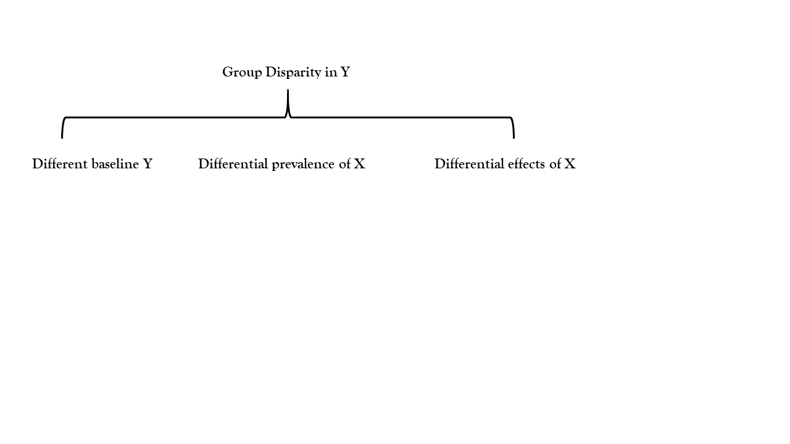

```{r}
#| include: false
options(digits=4)
library(tidyverse)
library(DasGuptR)
library(marginaleffects)
scot_v_eng <- 
  tribble(
    ~country, ~n_people, ~n_women1544, ~n_births,
    "Scotland", 5546900, 1064441, 45763,
    "England", 58620101, 11583779, 567708
  ) |>
  mutate(
    propw1544 = n_women1544/n_people,
    bpw  = n_births/n_women1544*1e3
  )
scot_v_eng2 <- 
  tribble(
    ~country, ~n_people, ~n_tesco, ~n_births,
    "Scotland", 5546900, 224, 45763,
    "England", 58620101, 2582, 567708
  ) |>
  mutate(
    proptsco = n_tesco/n_people*1e3,
    bpt  = n_births/n_tesco
  )
```

# Notes on Das Gupta

## A misnomer.. 

- Das Gupta uses terms such as "A-effect", "B-effect".  

- People (self included) are lax with the word "effect" in many areas of statistics  

- It's probably even less appropriate in DG decomposition

```{r}
#| echo: true
scot_v_eng

dgnpop(scot_v_eng,
       pop = "country",
       factors=c("propw1544","bpw")) |>
  dg_table()
```


## A misnomer.. 

- Das Gupta uses terms such as "A-effect", "B-effect".  

- People (self included) are lax with the word "effect" in many areas of statistics  

- It's probably even less appropriate in DG decomposition


```{r}
#| echo: true
scot_v_eng2

dgnpop(scot_v_eng2,
       pop = "country",
       factors=c("proptsco","bpt")) |>
  dg_table()
```

<div style="position: absolute; bottom: 20px; right: 20px; font-size: 0.6em;">
(other supermarkets are available)
</div>

## this is true!  

*if England and Scotland had same number of tesco stores per person, but differed in the number of births per tesco store, the England/Scotland birth rate difference would be 46% of the size that it is.*    

:::{.fragment}
<br>

but is it useful?

probably not... 

:::

<div style="position: absolute; bottom: 20px; right: 20px; font-size: 0.6em;">
(other supermarkets are available)
</div>

## Arithmetic, not stochastic

- all we are doing is moving numbers around!  

- there's no estimation happening  

- but we *are* in the world of counterfactuals.. 


## counterfactuals, but not potential outcomes

counterfactual:  

- *if Scotland had X tesco stores per person, and Z births per tesco, what would the nr births per person be?*  

potential outcome:  

- *if we gave Scotland more tesco stores, what would the nr births per person be?*  
- *if we give a Scottish _person_ access to 1 more tesco store, what would the probability of them giving birth be?*  


## counterfactuals

"Standardized rates are 'artificial', summaries of a world we do not live in."  
<p style="text-align:right; font-size:.8em">(Ben, this morning)</p>  

```{r}
#| echo: true
dgnpop(scot_v_eng2,
       pop = "country",
       factors=c("proptsco","bpt")) |>
  dg_table()
```

## estimands

What is your estimand?  

- a descriptive disparity between two populations' birth rates were they to be the same with respect to the number of births per tesco store?  

- a causal difference in the numbers of birth between two populations due to their different numbers of tesco stores?  


## Das Gupta

|     |     |
| --- | --- |
| What does it decompose? | $R_a - R_b$ : Group difference in **calculated rate** |
| Into what parts? | Whatever bits make up how we're calculating the rate | 
| How? | averaging over the possible calculations substituting in each groups' parts of the rate calculation |
| Counterfactual | What would the difference in rates be if [all parts of rate function but $\alpha$] were the same between $a$ and $b$? |

# Regression methods of decomposition  

## macro vs micro  

::::{.columns}
:::{.column width="50%"}
__Aggregate counts__
```{r}
tribble(
    ~population, ~n_people, ~n_tesco, ~n_births,
    "Scotland", 500, 20,  90,
    "England", 6000, 200, 500,
  )
```
:::
:::{.column width="50%"}
__Individual People__  
```{r}
tibble(
  person = 1:10,
  population = c(rep("England",3),"Scotland",rep("England",4),"Scotland","England"),
  tesco = c(0,0,0,1,0,0,1,0,0,0),
  birth = c(1,0,0,1,0,0,0,1,0,1)
) |> as.data.frame() |>
  rbind("...")
```
:::
::::


## macro vs micro  

::::{.columns}
:::{.column width="50%"}
__Aggregate counts__
```{r}
tribble(
    ~population, ~n_people, ~n_tesco, ~n_births,
    "Scotland", 500, 20,  90,
    "England", 6000, 200, 500,
  )
```
:::
:::{.column width="50%"}
__Intermediate Units__  
```{r}
tibble(
  datazone = c("S01006653","E01002868", "E01005123", "E01006655", "E01009123",
               "S01008935","E01012345", "E01016421", "E01033732", "E01000001"
               ),
  population = c("Scotland",rep("England",4),"Scotland",rep("England",4)),
  ntesco = c(1,2,3,1,2,0,2,4,2,5),
  nbirth = c(10,43,67,102,234,22,54,78,94,89)
) |> as.data.frame() |>
  rbind("...")
```
:::
::::

## regression: estimating conditional expectations

- $\mathbb{E}[Y|X]$ - expected value of Y conditional upon X
    - expected number/probability of births given number/presence of tesco, for a given population.  

- estimating conditional expectation allows us to move towards a decomposition of group disparities into:  
    - differential prevalence (like Das Gupta)
    - differential effects


## Oaxaca-Blinder

|     |     |
| --- | --- |
| What does it decompose? | $\mathbb{E}_a[Y] - \mathbb{E}_b[Y]$ : Group difference in **expected value of Y** | 
| Into what parts? | differences in $\mathbb{E}[X]$ ("endowments")<br>differences in $\mathbb{E}[Y|X]$ ("returns") |
| How?  | Estimates functional relationship between X and outcome Y in each group |
| Counterfactual |  <span style="font-size:.8em">What would the difference in Y be if group B had group A's 'endowments' $\mathbb{E}_a[X]$, but kept the same 'returns' $\mathbb{E}_b[Y|X]$?<br>What would the difference in $Y$ be if group B kept its own characteristics X but had the same X-Y relationship as in group A?</span>  |


## Oaxaca-Blinder? 

- [Rahimi & Nazari 2021:](https://pubmed.ncbi.nlm.nih.gov/34362385/){target="_blank"} A detailed explanation and graphical representation of the Blinder-Oaxaca decomposition method with its application in health inequalities

- [Hlavac 2014:](https://papers.ssrn.com/sol3/papers.cfm?abstract_id=2528391){target="_blank"} oaxaca: Blinder-Oaxaca Decomposition in R

- A rabbit hole: [Oaxaca & Sierminska 2025](https://journals.plos.org/plosone/article?id=10.1371/journal.pone.0321874){target="_blank"} Oaxaca-Blinder meets Kitagawa: What is the link?

## Group difference or Group effect?  

::::{.columns}
:::{.column width="45%"}
### group "difference"  

aim is to understand **why** (structurally) a disparity exists

<br>
How much of the *difference* in Y between groups can be attributed to the fact that groups have different distributions/effects of X on Y?

:::
:::{.column width="10%"}

:::
:::{.column width="45%"}
### group "effect" 

aim is to understand **how** a process/mechanism works  

<br>
How much of the *effect* on Y of being in group A vs B is *because* the grouping has an effect on M and M has an effect on Y?  

:::
::::

## Mediation

|     |     |
| --- | --- |
| What does it decompose? | $\mathbb{E}[Y^a] - \mathbb{E}[Y^b]$ : Group **effect.**<br>Expected change in Y had an entity been in group $a$ vs in group $b$. | 
| Into what parts? | <span style="font-size:.8em">Direct effect of group on Y $\mathbb{E}[Y^{a,M^b}] - \mathbb{E}[Y^{b,M^b}]$<br>Indirect effect of group on Y via M $\mathbb{E}[Y^{a,M^a}] - \mathbb{E}[Y^{a,M^b}]$</span> |
| How?  | <span style="font-size:.8em">Estimates the functional relationship between the grouping and M, and the joint relationship of the grouping and M on the outcome.</span> |
| Counterfactual | <span style="font-size:.8em">How much would Y change were a unit to move from group $a$ to $b$ but hold $M$ constant?<br>How much would Y change were a unit to stay in group $a$, but changed its $M$ the amount by which we would expect $M$ to change if it moved from group $a$ to $b$.</span> | 


## Mediation? 

- it's probably not want you want.  

- requires much more stringent causal assumptions that are almost impossible to satisfy (no unmeasured confounding of Group -> Y, of Group -> M, of M -> Y).  

<br><br>

- [Rohrer et al., 2022](https://journals.sagepub.com/doi/10.1177/25152459221095827){target="_blank"} That’s a Lot to Process! Pitfalls of Popular Path Models

- [The 100% CI Blog, 2025](https://www.the100.ci/2025/03/20/reviewer-notes-thats-a-very-nice-mediation-analysis-you-have-there-it-would-be-a-shame-if-something-happened-to-it/) Reviewer notes: That’s a very nice mediation analysis you have there. It would be a shame if something happened to it.

- [uoepsy.github.io/lv Chapters 6](https://uoepsy.github.io/lv/06_intropath.html){target="_blank"} and [7](https://uoepsy.github.io/lv/07_mediation.html){target="_blank"}.  


## baseline, prevalence, effect

{fig-align="center" width="100%"}
## baseline, prevalence, effect

{fig-align="center" width="100%"}

## group disparity

{fig-align="center" width="100%"}

## baseline

{fig-align="center" width="100%"}

## prevalence

{fig-align="center" width="100%"}

## effect

{fig-align="center" width="100%"}

## baseline, prevalence, effect, selection

{fig-align="center" width="100%"}
---

{fig-align="center" width="100%"}
---

{fig-align="center" width="100%"}
---


{fig-align="center" width="100%"}
---

{fig-align="center" width="100%"}

---

{fig-align="center" width="100%"}

---

{fig-align="center" width="100%"}

:::{.aside}
See [Yu & Elwert 2023: Nonparametric causal decomposition of group disparities](https://projecteuclid.org/journals/annals-of-applied-statistics/volume-19/issue-1/Nonparametric-causal-decomposition-of-group-disparities/10.1214/24-AOAS1990.pdf){target="_blank"}
:::

# End