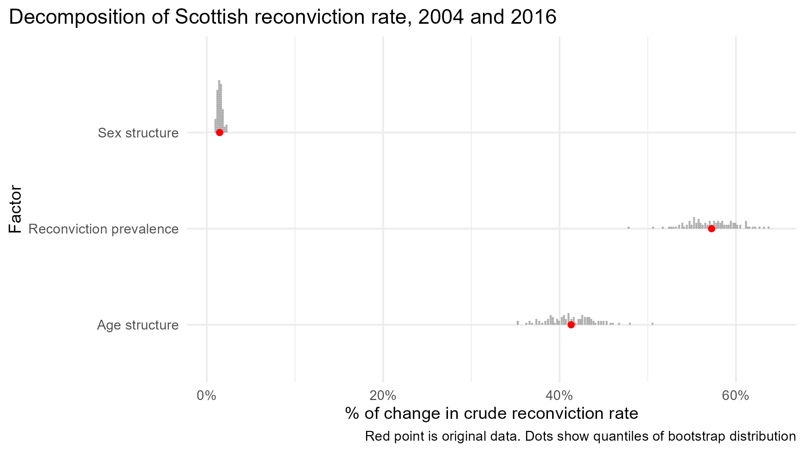
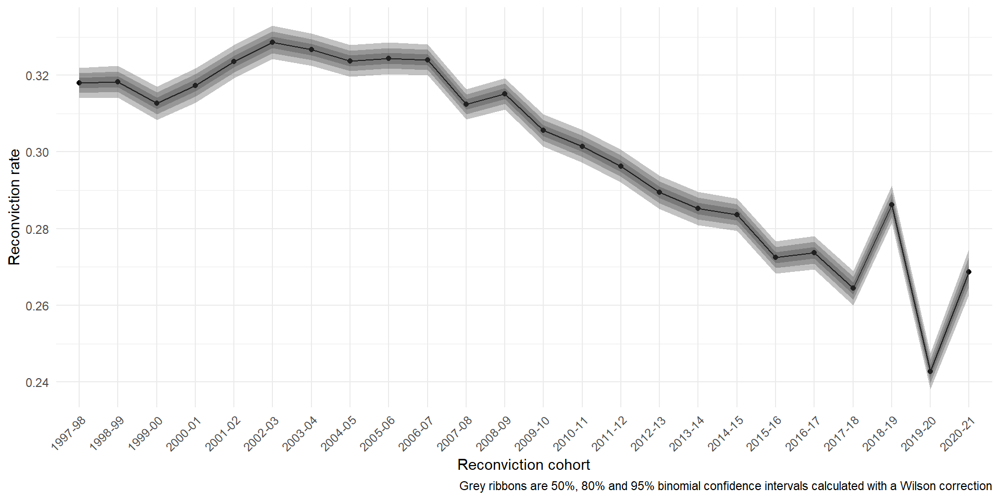
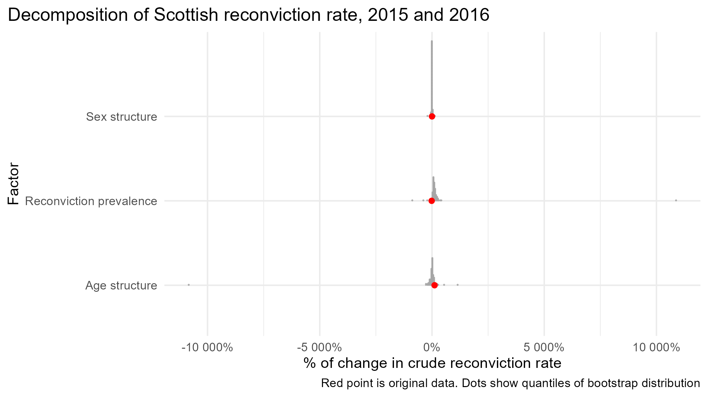
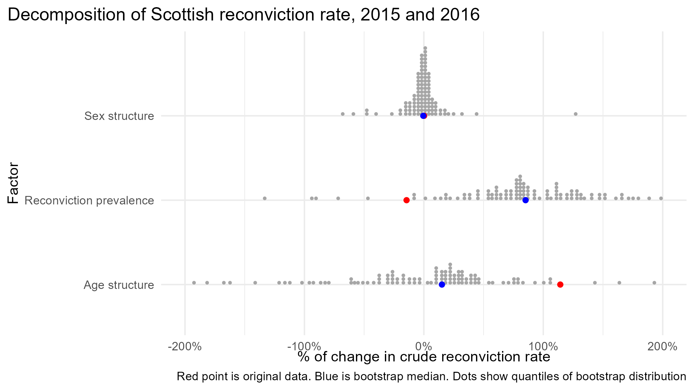

```{r}
#| include: false
options(digits = 2)
```

## Whence uncertainty?

- Unlike regression the Das Gupta method doesn't really have a concept of an error term - all results are calculate algebraically [@dasguptaStandardizationDecompositionRates1993]
- But we might still want to quantify uncertainty in the results of a standardization and decomposition
- Bootstrapping is a general purpose way to achieve this [@carseyMonteCarloSimulation2014]
- It can also show where results might be sensitive to small changes in the data (typically if the absolute difference between the rates you are decomposing is small) - we will see an example of this later

# Part One: Bootstrapping

## Bootstrapping

- Bootstrapping is a resampling method where you create an empirical distribution of estimates of your quantity of interest through resampling
- It is, as it were, a dumb strategy - it doesn't try to be clever and use maths to calculate the appropriate uncertainty with appeals to asymptotics, it just reshuffles your data a bunch and re-runs your analysis on each resampled dataset
- The maths way assumes your data comes from a nice smooth distribution; bootstrapping makes an empirical distribution via resampling

# An example of sampling with replacement


## Bootstrapping

- There are different ways to achieve this
- Here we adopt a _non-parametric_ bootstrap [@carseyMonteCarloSimulation2014] where you sample with replacement from the original data and re-run the analysis on each bootstrap draw
- This is also what Li [-@liRateDecompositionAggregate2017] does
- There is a worked example if we have time and options in the practical

## Bootstrapping example

```{r echo=TRUE}

set.seed(387) # for reproducibility

results <- c(1, 3, 2.7, 10, 1)

results

mean(results)
```

## Bootstrapping example
- Sample with replacement from the results to create a new set of results the same size as the original results

```{r echo=TRUE}
boot_1 <- sample(results, size = length(results), replace = TRUE)

data.frame(results = results, boot_1 = boot_1)

data.frame(results = mean(results), boot_1 = mean(boot_1))

```

## Bootstrapping example
- And do it again...
```{r echo=TRUE}
boot_2 <- sample(results, size = length(results), replace = TRUE)

data.frame(results = results, boot_1 = boot_1, boot_2 = boot_2)

data.frame(results = mean(results), boot_1 = mean(boot_1), boot_2 = mean(boot_2))

```

## Bootstrapping example
- ... and again ...
```{r echo=TRUE}
boot_3 <- sample(results, size = length(results), replace = TRUE)

data.frame(results = results, boot_1 = boot_1, boot_2 = boot_2, boot_3 = boot_3)

data.frame(results = mean(results), boot_1 = mean(boot_1), boot_2 = mean(boot_2), boot_3 = mean(boot_3))
```

## Bootstrapping example
- ... like 1000 times. Then we can see the range of results from the resampling.
```{r echo=TRUE}
boot_1000 <- sample(results, size = length(results), replace = TRUE)

data.frame(results = results, boot_1 = boot_1, boot_2 = boot_2, boot_3 = boot_3, boot_1000 = boot_1000)

data.frame(results = mean(results), boot_1 = mean(boot_1), boot_2 = mean(boot_2), boot_3 = mean(boot_3), boot_1000 = mean(boot_1000))
```

## Bootstrapping example
- 
```{r echo=FALSE}
library(tidyr)
library(dplyr)
library(purrr)
library(ggplot2)

res_df <- 
tibble(
  draw = 1:10000
) |> 
  mutate(sample = map(draw, ~ sample(results, size = length(results), replace = TRUE))) |> 
  unnest(sample) |> 
  group_by(draw) |> 
  summarise(mean = mean(sample)) |> 
  ungroup()

res_df |> 
  ggplot(aes(x = mean)) +
  geom_histogram() +
  geom_vline(xintercept = mean(results), colour = "red") +
  geom_vline(xintercept = median(res_df$mean), colour = "blue", linetype = "dashed") +
  labs(caption = "Histogram showing 10,000 bootstrap resamples. Red line is mean of original results. Blue line is median of bootstrapped means")
```


# Example

## Try it for yourself
- Navigate to https://benmatthewsed.github.io/sgsss_std_decomp/bootstrap_demo
- Play around with the different options


## Boostrapping example
- In this method you bootstrap *the data* and then perform whatever analysis you like on each resample
- You then get an empirical distribution of results (remember this histogram!)
- Pros: this will (almost) always work, makes no assumptions about distributions or anything
- Cons: the amount of memory required scales with the number of units, your computer might run out of memory/catch on fire (if you are analysing population level data from India this approach will take a lot longer than if you are analysing population data from Scotland)
- Okay your computer probably won't _really_ catch on fire, but if you are planning to bootstrap some large data you will have to think about the practicalities (feel free to ask us if you are planning this!)


## Bootstrapping standardization and decomposition
- Standardization and Decomposition is often using aggregate data
- To use the non-parametric bootstrap here you need[^3] to expand the data out to unit-level data, then take the re-samples, then aggregate each re-sample back up to perform the standardization and decomposition

[^3]: At least, I don't know of any! This is also what Li [-@liRateDecompositionAggregate2017] does. If there are other clever ways to do this let me know!


## Bootstrapping in practice

- To do this in practice you need to create a function (in R; program in Stata) to essentially “uncount”/explode the data into individual level data (where nrow = size of total population), then re-sample the unit-level data with replacement, then aggregate back up to the level of the original data
- Then you standardize and decompose each resampled dataset

## Bootstrapping in practice
1. 'Explode' the aggregate data
2. Resample the exploded data say 200 times (NB more is always better)
3. Aggregate each of the 200 datasets
4. Standardize and decompose 200 times
5. Summarise the results

## Exploding data

::::{.columns}
:::{.column width="50%"}
__Aggregate counts__
```{r}

## pick up here
tibble::tribble(
    ~population, ~n_people, ~n_died,
    "Scotland", 500, 20,
    "England", 6000, 200
  )
```
:::
:::{.column width="50%"}
__Individual People__  
```{r}
deaths <- 
data.frame(
  population = sample(c(rep("England",6000),rep("Scotland",500)), replace = FALSE,
  size = 6000+500),
  died = c(sample(c(rep(1, 200), rep(0, 6000-200)), replace = FALSE), 
  sample(c(rep(1, 20), rep(0, 500-20)), replace = FALSE))
)

deaths
```
:::
::::

## Resampling the exploded data

```{r}

boot_1 <- 
deaths |> 
  dplyr::sample_n(size = nrow(deaths),
  replace = TRUE)

boot_1

```

## Aggregating


```{r}

agg_boot_1 <- 
boot_1 |> 
  dplyr::count(population, died)

deaths |> 
  dplyr::count(population, died)

```


## Summarising the results
- After all this you can calculate a standard error or confidence interval around the decomposition results (see @liRateDecompositionAggregate2017)
- There are lots of ways to do this - people have [written](https://hastie.su.domains/CASI/) [books](https://www.cambridge.org/core/books/bootstrap-methods-and-their-application/ED2FD043579F27952363566DC09CBD6A) on it
- Or you can visualize the empirical distribution of the results as we did before

## A nice example


# Add in practical example here 


# Part Two: When things go wrong

## When things go wrong
- Decomposition will decompose whatever difference there is - even if it is very small
- If there isn't much difference in the underlying crude rate you are decomposing (in a hand-wavy way, if the difference is not statistically significant) then things can do haywire
- The sampling distribution of underlying rates is usually quite nice (a Normal approximation is probably fine)
- But a decomposition is essentially a ratio - a transformation of the standardized rates
- The sampling distribution of a transformed quantity will not necessarily be the same as the sampling distribution of the two underlying quantities
- In particular the sampling distribution of ratios can be nice or really not nice [@franzRatiosShortGuide2007]


## The sampling distribution of decomposition
- If there isn't much difference in the underlying crude rate you are decomposing (in a hand-wavy way, if the difference is not statistically significant) then things can go haywire
- If the standardized rates are very close together then the decomposition can involve dividing by very small numbers
- Uh oh

## An example



## A not-so-nice example


## A not-so-nice example
- The scale runs from -10,000% to +10,000%!
- So lets zoom in for a closer look

## A not-so-nice example


## A not-so-nice example
- The average bootstrap replication (the blue dot) does not match the observed data (the red dot)
- This isn't a sample size problem - more bootstrap replications will give the same results

## How can this be?

- I was very confused by the bad decomposition - why would the bootstrapping lead to these wild estimates (huge confidence intervals not centered on the true values!)
- The thing I was bootstrapping was the underlying data - and the bootstrapped distribution _of the crude rates_ is fine
- But the decomposition is a transformation of these rates, and the properties of the rates do not necessarily transfer downstream to the transformation

## Do I need to worry about this?
- Maybe you could argue that you don't need to factor in uncertainty in the underlying rates - in this case we are working with adminisrative, the reconviction cohorts are what they are
- This is an actual philosophical debate [see @verlaanUseInferentialStatistics2024]
- But maybe you are working with survey data when you have a rate and a standard error
- I (Ben) also think it's useful to know how sensitive your results are to small changes in the input data, as much for pragmatic reasons as philosophical reasons
- Bootstrapping the raw data (nonparametric simulation [see @carseyMonteCarloSimulation2014]) can show when your results are fragile to small permutations in the data [see also @giordanoAutomaticFinitesampleRobustness2026]


## Two practical suggestions
- Check whether the difference in crude rates between comparator is statistically significant before you do your standardization and decomposition
- Bootstrap your results a few times as a matter of course just to see if something breaks

# Bonus slides: A worked example of bootstrapping in practice


## Bootstrapping in practice: Exploding the data

```{r}
#| echo: true

library(tidyverse)
library(DasGuptR)

# just the first and last year
dat_2004_2016 <- 
  DasGuptR::reconv |> 
  filter(year == "2004" | year == "2016")

# we need to turn the dataset into a 'tidy' dataframe with columns for
# year, Age, Sex, whether a person was reconvicted or not, n

dat_2004_2016_long <- 
  dat_2004_2016 |> 
  mutate(not_reconvicted = offenders - reconvicted) |> 
  select(year, Age, Sex, not_reconvicted, reconvicted) |> 
  pivot_longer(not_reconvicted:reconvicted, names_to = "reconvicted", values_to = "n") |> 
  mutate(n = as.integer(n)) |>
  uncount(n) # this takes the n column and explodes the data using the counts
# of people convicted and not reconvicted
```

## Bootstrapping: 2. Resampling

- Now we have an 'individual' level dataset for our reconviction cohorts we can resample from them with replacement
- We use functions from the [`{rsample}`](https://rsample.tidymodels.org/) package to do this in a memory efficient way
- Because bootstrapping uses random number generation we need to set the seed before starting so our results are reproducible
- We also need to set the number of draws. We'll use 200 for speed; but more is always better


```{r}
#| echo: true
library(rsample)

set.seed(12345)

n_draws <- 200

draws_2004_2016 <- 
dat_2004_2016_long |> 
  group_by(year) |> # we bootstrap within years - this keeps the sizes of the reconviction cohorts the same
  rsample::bootstraps(times = n_draws)

```

## Boostrapping: 2. Resampling

- We now have 200 of... something

```{r}
#| echo: true
draws_2004_2016

```

## Bootstrapping: 3. Aggregating

- Now we can convert these memory-efficient, individual level resamples from our data to aggregate data ready to standardize and decompose
- To do this we need to use R's programming functions to iterate over each bootstrap resample and aggregate them
- We will write a helper function to do this

## Writing an R function

- Functions in R let you easily re-run code
- If you have not written an R function before you might want to check out the [Functions chapter in R for Data Science](https://r4ds.hadley.nz/functions.html) [@wickhamR4DS2023]

## Bootstrapping: 3. Aggregating

```{r}
#| echo: true
# create a helper function to aggregate the results o

uncount_split <- function(splits){
  
  rsample::analysis(splits) |> 
    count(year, Age, Sex, reconvicted) |> # this is the opposite of uncount()
    pivot_wider(names_from = "reconvicted", # this gets the data back in the
                values_from = "n") |> # right shape for dgnpop
    mutate(offenders = not_reconvicted + reconvicted,
           prev_rate = reconvicted / offenders)
  
}

```

## Bootstrapping: 3. Aggregating

- Now we have our helper function we can apply it to each bootstrap draw
- We use the `map` function from the [`{purrr}`](https://purrr.tidyverse.org/) package
- [Jenny Bryan](https://bsky.app/profile/jennybryan.bsky.social) has written the [definitive guide to iteration with `{purrr}`](https://jennybc.github.io/purrr-tutorial/index.html) 
- The basic intuition is each bootstrap draw is a row of our `draws_2004_2016` dataframe, and we want to aggregate each one
- In other words, we want to `map` the aggregation to each of the bootstrap draws

## Bootstrapping: 3. Aggregating

```{r}
#| echo: true
draws_2004_2016 <- 
draws_2004_2016 |> 
 mutate(agg_data = map(splits, uncount_split))

```

## Bootstrapping: 3. Aggregating

```{r}

draws_2004_2016

```

## Bootstrapping: 3. Aggregating

- Look at the first aggregated draw

```{r}
#| echo: true
draws_2004_2016$agg_data[[1]]

```

## Bootstrapping: 3. Aggregating

- Look at the second aggregated draw

```{r}
#| echo: true
draws_2004_2016$agg_data[[2]]

```

## Bootstrapping: 4. Standardize and decompose

- We can use the same pattern of creating a helper function and then applying it to each row of `draws_2004_2016` to standardize and decompose 200 times

## Bootstrapping: 4. Helper function

```{r}
#| echo: true
calc_dg <- function(d){
  # This just wraps the standard dgnpop call for the reconvictions data
  d |> 
    dgnpop(pop="year", 
           factors=c("prev_rate"),id_vars=c("Sex","Age"),
           crossclassified="offenders",
           agg = TRUE) |> 
    dg_table() |> 
    rownames_to_column() # this helps keep track of the results
  
}
```

## Bootstrapping: 4. Standardize and decompose

- NB this might take a while!

```{r}
#| echo: true
draws_2004_2016 <- 
draws_2004_2016 |> 
  mutate(results = map(agg_data, calc_dg), # apply dgnpop to each aggregated dataset
         draw = 1:n_draws) |> # add an index which says which draw number the results are from
  select(draw, results) # only keep the draw number and results column
```

## Bootstrapping: 4. Standardize and decompose

- We now need to expand out the results with `unnest`
```{r}
#| echo: true
decomp_draws <- 
draws_2004_2016 |> 
    unnest(results) |> 
     pivot_longer(`2004`:`2016`,
               names_to = "year",
               values_to = "rate") |> 
     filter(year == "2016") # the decomposition results are the same for both years, so we'll just keep one set

```

## Bootstrapping: 5. Visualize

```{r}

library(ggdist)

decomp_draws |> 
ggplot(aes(x = decomp, y = rowname)) +
  ggdist::stat_dots(quantiles = 100)

```

## Bootstrapping: 5. Visualize

```{r}

# get rid of the crude

decomp_draws |> 
  filter(rowname != "crude") |> 
  ggplot(aes(x = decomp, y = rowname)) +
  ggdist::stat_dots(quantiles = 100)

```


## Bootstrapping: 5. Visualize

```{r}

# tidy up a bit
decomp_fig <- 
decomp_draws |> 
  filter(rowname != "crude") |> 
  mutate(rowname = case_when(
    rowname == "prev_rate" ~ "Reconviction prevalence",
    rowname == "Sex_struct" ~ "Sex structure",
    rowname == "Age_struct" ~ "Age structure",
  )) |> 
  ggplot(aes(x = decomp, y = rowname)) +
  ggdist::stat_dots(quantiles = 100) +
  theme_minimal() +
  scale_x_continuous(labels = scales::label_percent(scale = 1)) +
  labs(x = "% of change in crude reconviction rate",
  y = "Factor",
  title = "Decomposition of Scottish reconviction rate, 2004 and 2016") +
    theme(plot.title.position = "plot")

```

## Bootstrapping in practice

- These are the original results

```{r}
res_2004_2016 <- 
dat_2004_2016 |> 
 dgnpop(pop="year", 
         factors=c("prev_rate"),id_vars=c("Sex","Age"),
         crossclassified="offenders") |> 
  dg_table() |> 
  mutate(across(where(is.numeric), ~ round(.x, 2))) |>
  rownames_to_column()
```

## Bootstrapping in practice

```{r}
res_2004_2016_plot <- 
res_2004_2016 |> 
   filter(rowname != "crude") |> 
  mutate(rowname = case_when(
    rowname == "prev_rate" ~ "Reconviction prevalence",
    rowname == "Sex_struct" ~ "Sex structure",
    rowname == "Age_struct" ~ "Age structure",
  ))

decomp_fig +
  geom_point(
    data = res_2004_2016_plot,
    colour = "red"
  ) +
    labs(caption = "Red point is original data. Dots show quantiles of bootstrap distribution")
```

## Bootstrapping in practice
- Now we can calculate standard errors and confidence intervals for these estimates
- (Actually it's bad practice to use the mean of the bootstrap draws instead of the observed results [@raineyCarefulConsiderationCLARIFY2024])

```{r}
decomp_draws |> 
  group_by(rowname) |> 
  summarise(mean_decomp = mean(decomp),
            se_est = sd(decomp),
            lower_ci = mean_decomp - 1.96 * se_est,
            upper_ci = mean_decomp + 1.96 * se_est)

```

## Bootstrapping in practice
- Or directly calculate confidence intervals by taking percentiles

```{r}
decomp_draws |> 
  group_by(rowname) |> 
  summarise(confs = list(quantile(decomp, c(0.5, 0.025, 0.975))),
            cis = list(c("median", "lower_ci", "upper_ci")),
            .groups = "drop") |> 
  unnest(c(confs, cis)) |> 
  pivot_wider(id_cols = rowname,
  values_from = confs,
  names_from = cis)
```


## References