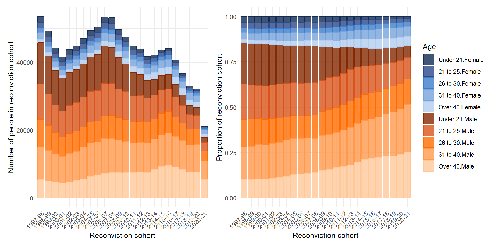
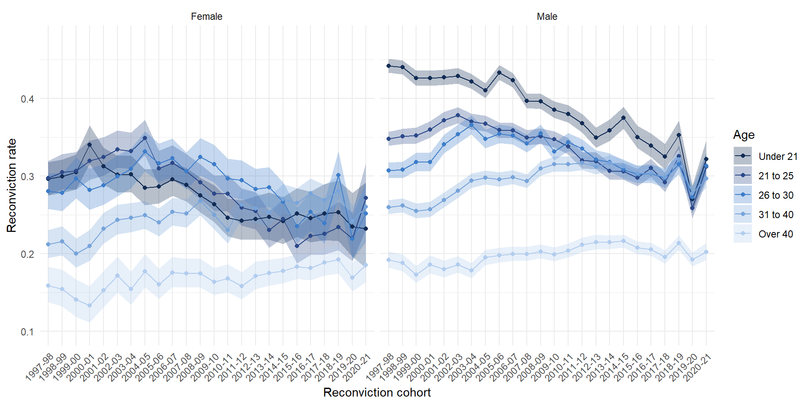
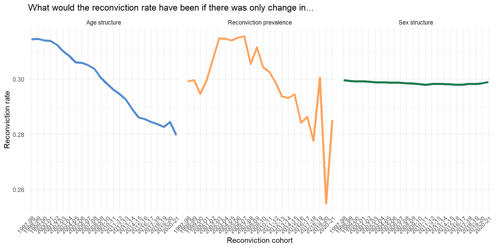

```{r}
#| include: false
options(digits=2)
```


# A motivating example: Why is Scotland's reconviction rate falling?

::: aside
aka Matthews, King and Buchan (in preparation)
:::

## Background
-   The crime drop [@farrellWhyCrimeDrop2014] has changed the demographics of people being convicted [@matthewsRethinkingOneCriminologys2018]
-   Changing demographics of people convicted complicates comparisons in the aggregate reconviction rate over time
-   The overall change in the reconvictions rate in Scotland is partly due to fewer reconvictions and partly due to changing demographics
-   This creates statistical bias in the aggregate reconviction rate if it's used as a measure of 'effectiveness' of the justice system
-   We demonstrate this problem with a worked example using Scottish reconvictions data

# Part One: The crime drop in Scotland {background-color="#006938"}

## The overall reconviction rate is falling


## The demographics of convictions are changing





## A gap in the crime drop

-   There has been *a lot* written about the causes of the crime drop [@farrellWhyCrimeDrop2014; @tonryWhyCrimeRates2014; @ballGreatDeclineAdolescent2023], including previous attempts to describe changes in the demographics of crime and use these descriptions to build explanations for why there is less crime now than in the past [@matthewsRethinkingOneCriminologys2018; @tuttleEndAgeCrimeCurve2024; @farrellDebutsLegaciesCrime2015]
-   One unexplored area these changing demographics can matter are when measuring Criminal Justice System 'performance'

# Part Two: Measuring 'Performance' {background-color="#006938"}

## Reconviction rates as a performance metric

-   The Sentencing Council (for England and Wales) says the reconviction rate is a "key metric for evaluating the effectiveness of sentencing" [@gormleyEffectivenessSentencingOptions2022, p18]

-   "Measuring recidivism is important, as it is one indicator of the effectiveness of the criminal justice system in the rehabilitation of offenders. Reconviction rates are a proxy measure for recidivism" [@scottishgovernmentReconvictionRatesScotland2024, p8] and "Reduce reconviction rates" was a National Performance Framework indicator from 2007 to 2018

-   The common logic is that if the reconviction rate goes down then the criminal justice system is doing a better job at rehabilitating offenders

## But it's not so simple

-   However, "differences in the offending related characteristics of those included in each cohort make comparing reoffending rates problematic, across both time and jurisdictions." [@browneAdultYouthReoffending2024, p19]

-   Because of changes in the distribution of characteristics of the people who have been convicted, change in the overall reconviction rate can be biased as a performance measure
- The overall change we see will be both due to changes in the prevalence of reconviction amongst demographic groups, but also the mix/composition of those groups who are in each reconviction cohort.

## The anatomy of a rate

-   To use reconviction rates as measures of criminal justice system 'performance' you only want to measure change in the subgroup rates
-   But change in the overall rate can come from either changes in the subgroup rates *or changes in the relative subgroup sizes*

> "If the target for a reduction in the overall reconviction rate is met, and this is mainly due to more people with a lower likelihood of re-offending being brought into the criminal justice system and being convicted, rather than through a reduction in rates of re-offending among those who would normally be brought into the system, this would bring little cause for celebration." [@kirkwoodEvidencingImpactCriminal2008, p9]

# Part Three: An alternative approach {background-color="#006938"}

## Standardization and decomposition

-   Standardization and decomposition can separate out changes in the reconviction rate that are due to demographic change from those due to change in the underlying reconviction rate for different age groups
-   Standardization and decomposition can also separate out the relative importance of different factors in driving aggregate change (e.g. age and sex)
-   Previous regression-based approaches [@francisPredictingReconvictionRates2005; @cunliffeReoffendingAdultsResults2007; @drakeWashingtonsOffenderAccountability2010]  to correct for the problem of changing 'offender mix' can perform this standardization part, but don't focus on the decomposition part
- The regression approach focuses on 'is the observed rate lower than some predicted rate' - but not quantifying the contribution of a given characteristic to the difference between observed and predicted rate

# Research design {background-color="#006938"}

---
smaller: false
---

## Research Question

-   How much of the change in the overall reconviction rate in Scotland between 1997 and 2022 is attributable to changing demographics?

## Data

-   We analyse data from 'reconviciton cohorts' in Scotland between 1997/1998-2020/21[@scottishgovernmentReconvictionRatesScotland2024]

-   A reconviction cohort is "all offenders who either received a non-custodial conviction or were released from a custodial sentence in a given financial year, from the 1st April to the 31st March the following year" [@scottishgovernmentReconvictionRatesScotland2024, p40]

-   There is nothing particularly special about these time points, and the same approach would work for other time periods and other characteristics

-   Some evidence that Scotland might be an extreme case here with larger demographic changes than in other countries [@matthewsAgecrimeCurveCrime2023]

## Measures

-   "The reconviction rate is presented as the percentage of offenders in the cohort who were reconvicted one or more times by a court within a specified follow up period from the date of the index conviction. For most reconviction analyses in this bulletin, the follow-up period is one year," [@scottishgovernmentReconvictionRatesScotland2024, p10]
-   We decompose the overall reconviction rate by age and sex
-   Age groups:
    -   Under 21, 21 to 25, 26 to 30, 31 to 40, over 40
-   Sex:
    -   Male, female

::: aside
Sex is "generally based on how a person presents and is recorded when a person’s details are entered into the \[Criminal Histories System\]. It is recorded for operational purposes, such as requirements for searching" [@scottishgovernmentReconvictionRatesScotland2024, p44]
:::

## Method

-   We will talk about this at length for the rest of the day!

# Results {background-color="#006938"}

## Change in reconviciton rate by age group


## Remember the changing demographic mix!


## How much change in the reconviction rate is due to demographic mix?



## Decomposition


## Standardization and Decomposition of Reconviction Rates in Scotland

| Impact of... | Reconviction cohort 1997–98 | Reconviction cohort 2020–21 | Difference in rates | % of crude difference |
|------------|----------------------------:|----------------------------:|-------------------:|---------------------:|
| Age structure | 0.31 | 0.28 | -0.03 | 70.30 |
| Sex | 0.30 | 0.30 | 0.00 | 1.45 |
| Reconviction rate | 0.30 | 0.29 | -0.01 | 28.25 |
| **Crude rate** | **0.32** | **0.27** | **-0.05** | **100.00** |

*Data from Scottish Government (2024). Calculations authors' own.


## Analysis

-   The dramatic changes in the demographics of people involved in the justice system that we have seen in Scotland distorts simple comparisons over time in aggregate performance measures such as the reconviction rate, because the people who make up reconviction cohorts in the early 2000s have a very different profile to those who make up reconvictions cohorts in the mid 2020s
-   Young people used to have the highest reconviction rate of all age groups, but this is has fallen
-   Those over 40 have consistently lower reconviction rates, but these have not fallen
-   Young people also used to make up more of the reconviction cohorts
-   In terms of the overall reconviction rate, a group of people with high levels of reconviction have been replaced by people with lower levels of reconviction


## Analysis

-   We can attribute about three-quarters of the fall in the reconvictions rate in Scotland between 1997/98-2020/21 to demographic change in the population of people convicted, rather than falls in the reconviction rate *per se*.[^1]
-   If you want to use the reconviction rate as a measure of sentencing effectiveness or similar, you would think the justice system is doing a much better job than it is
-   In an optimistic reading the change in the mix of people being reconvicted could still be due to criminal justice practices (e.g. more diversion from prosecution for young people), but *is not attributable to the 'effectiveness' of the criminal justice system in rehabilitating offenders* - it is purely due to changes in the demographic mix of people being convicted in the first place


[^1]: If you change the comparison years to compare a year in the 2000s to 2020/1 this falls to around half of the overall change attributable to changes in age structure.

## References